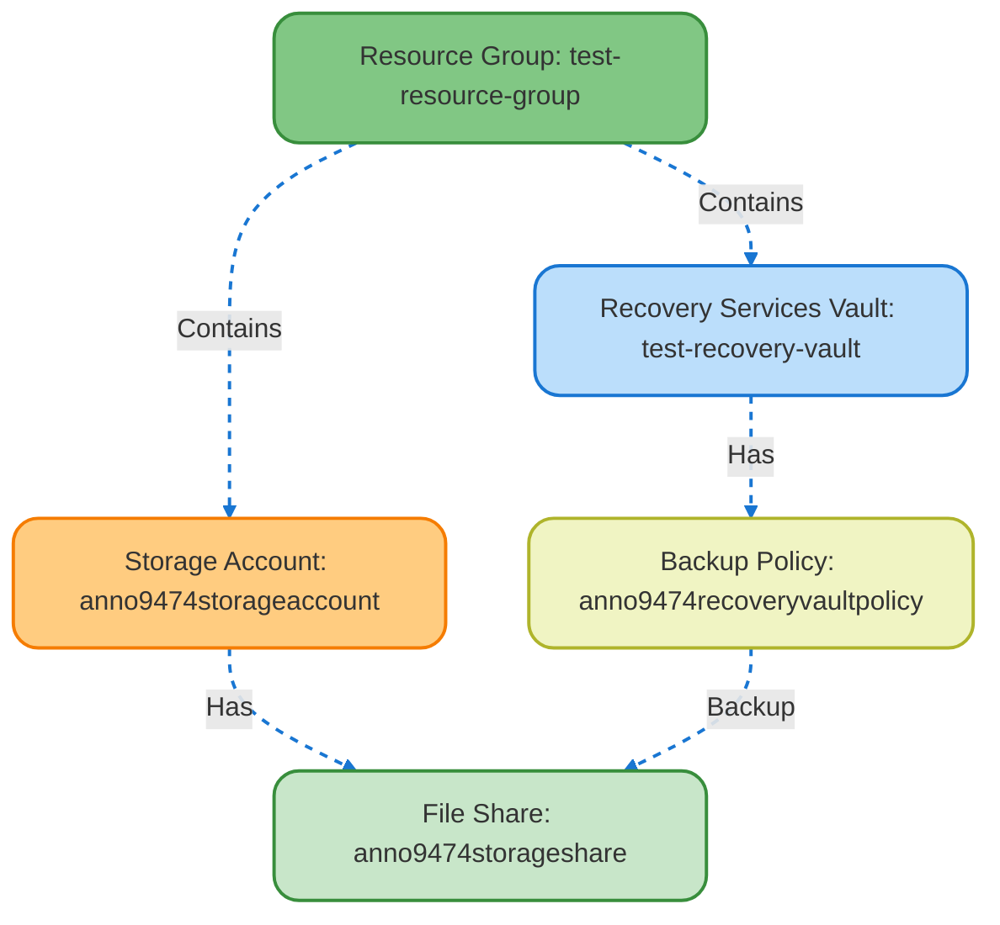

# 01 - Storage Account Setup with File Share and Backup Policy

## 🔧 Resources Created

- **Resource Group** (`azurerm_resource_group`)
- **Storage Account** (`azurerm_storage_account`)
- **File Share** (`azurerm_storage_share`)
- **Recovery Services Vault** (`azurerm_recovery_services_vault`)
- **Backup Policy** (`azurerm_backup_policy_file_share`)

## 🔗 Relationships

- The **Storage Account** is created inside the **Resource Group**
- The **File Share** is part of the **Storage Account**
- The **Recovery Services Vault** is also in the same **Resource Group**
- The **Backup Policy** is defined in the **Vault** and is meant to be linked to the **File Share**

## 📝 Notes

- The file share quota was set to `5GB`
- The backup policy uses daily backups and has retention rules for daily, weekly, monthly, and yearly snapshots
- All sensitive values are passed using `.auto.tfvars` and **not committed** to the repo

---
